# Securing a Healthcare Workload on Microsoft Azure: MediData Solutions

**Course:** ISN 4153 Cloud Computing Security, Final Examination, Setting A (Summer 2026)

**Student:** Mbassi Rick Bryan

**Student ID:** ICTU20261126

**Date:** 7 October 2026

**Repository:** https://github.com/M-Riq/MEDIDATA-AZURE-CLOUD-SECURITY

---

## Table of Contents

1. Introduction
2. Design and Implementation
3. Justification of Security Controls
4. Compliance Analysis
5. Lessons Learned
6. References

Appendix A: Environment Summary

Appendix B: Figure Index

---

## 1. Introduction

MediData Solutions is a mid-sized healthcare company moving its patient records and backups from on-premises servers to Microsoft Azure. Patient records are Protected Health Information (PHI), so the U.S. HIPAA Security Rule (45 CFR Part 164, Subpart C) applies. It requires administrative, physical and technical safeguards for PHI.

The objective of this project was to design, build and validate a secure Azure foundation for this workload. It covers:

- identity and access management with custom least-privilege roles
- network segmentation following Zero Trust principles
- encryption at rest with customer-managed keys
- centralised security monitoring and alerting
- a HIPAA compliance assessment, with gap analysis and remediation

**Scope and constraints.** All resources were deployed in one Resource Group, `MediData-Project-A-Bryan`, in the France Central region, using an academic subscription. To keep costs near zero, no virtual machines or databases were deployed, and only free or basic tiers were used. Controls that need paid services are documented as *proposed*. All data is synthetic. The project shows controls that *support* HIPAA-aligned practice; it does not claim the environment is HIPAA compliant.

---

## 2. Design and Implementation

### 2.1 Architecture Overview

```text
                 Internet
                    |  TCP 80/443 only
+-------------------v--------------------------------------------+
| Resource Group: MediData-Project-A-Bryan        (RBAC scope)   |
|                                                                |
|  VNet vnet-medidata-a  10.10.0.0/16                            |
|   +----------------+  8080  +----------------+  1433           |
|   | Web-Subnet     | -----> | App-Subnet     | -------+        |
|   | 10.10.1.0/24   |        | 10.10.2.0/24   |        v        |
|   +----------------+        +----------------+  +-------------+|
|                                                 | Data-Subnet ||
|                                                 | 10.10.3.0/24||
|                                                 +------+------+|
|                        service endpoints (KV, Storage) |       |
|  Storage stmedidatabryan9918 <--- CMK --- Key Vault kv-...     |
|  (firewall: Deny, Data-Subnet only)  (firewall: Deny, Data-Subnet only)
|                                                                |
|  Diagnostic settings -> law-medidata-bryan -> Alert -> Email   |
|  Azure Policy (HITRUST/HIPAA, audit) -> compliance dashboard   |
+----------------------------------------------------------------+
```

| Resource | Name | Purpose |
|---|---|---|
| Resource Group | `MediData-Project-A-Bryan` | Single scope for RBAC, policy and cleanup |
| Virtual network | `vnet-medidata-a` (10.10.0.0/16) | Network boundary |
| Subnets + NSGs | Web, App, Data with `nsg-web-subnet`, `nsg-app-subnet`, `nsg-data-subnet` | Three-tier segmentation |
| Storage account | `stmedidatabryan9918` | Patient data and backups |
| Key Vault | `kv-medidata-bryan-22581` | Customer-managed key `cmk-medidata-storage` |
| Log Analytics | `law-medidata-bryan` | Central log store |
| Action group / alert | `ag-medidata-security` / `alert-kv-excessive-auth-failures` | Detection and notification |
| Policy assignment | `medidata-hipaa-hitrust` | Compliance assessment |

### 2.2 Identity and Access Management (Part 1.1)

Three custom Azure RBAC roles were created and assigned at Resource Group scope to dedicated test users.

| Role | Allowed | Blocked |
|---|---|---|
| MediData-ReadOnlyAuditor | `*/read` on the management plane | Any write or delete; no data-plane access |
| MediData-SecurityAdmin | Read all; Defender for Cloud (`Microsoft.Security/*`); policy assignments and exemptions; policy insights; log search | Creating or deleting workload resources; enabling paid Defender plans |
| MediData-DataEngineer | Read all; `Microsoft.Storage/*`; `Microsoft.Sql/*`; deployments | Network changes (`Microsoft.Network` writes, SQL firewall rules); security policies |

All three roles have an empty `DataActions` list. Being able to manage a resource therefore does not give access to the patient data inside it.

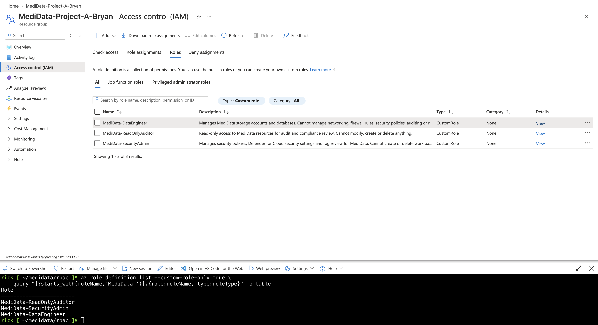

*Figure 1: The three custom roles in the Azure Portal.*

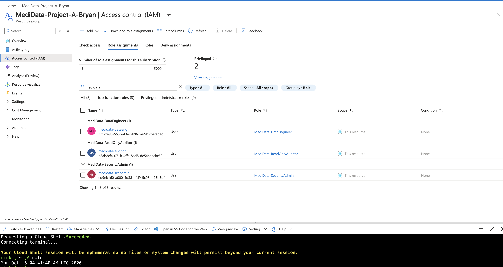

*Figure 2: Role assignments at Resource Group scope.*

**Validation.** Each role was tested by signing in as its test user:

- the Auditor could read but was denied any write (`AuthorizationFailed`)
- the SecurityAdmin could manage security settings but could not create workload resources
- the DataEngineer could manage storage but could not change network resources

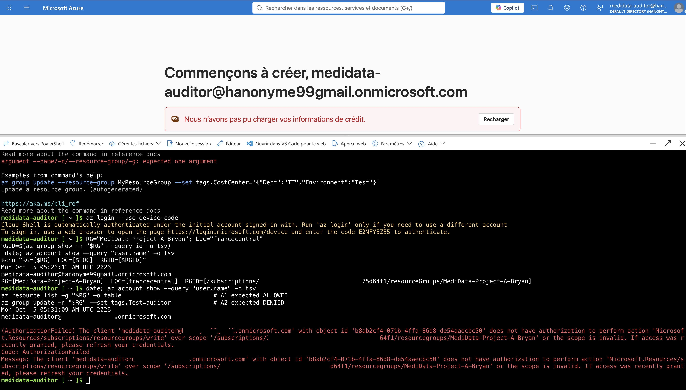

*Figure 3: Auditor test, read allowed and write denied.*

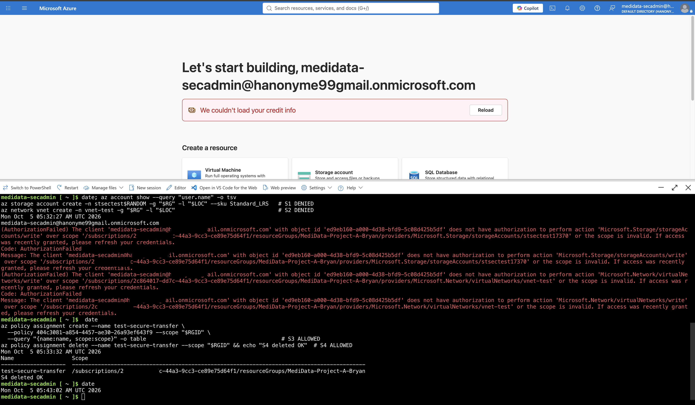

*Figure 4: SecurityAdmin test, denied and allowed actions.*

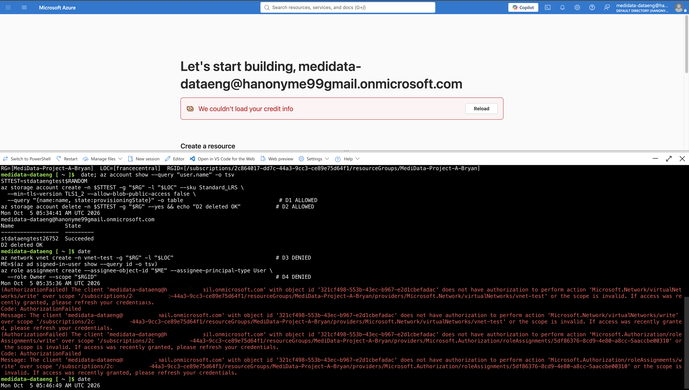

*Figure 5: DataEngineer test, allowed and denied actions.*

**Known limitations.**

1. `NotActions` is not a deny; a second role could grant the action back.
2. Storage firewall settings are part of `storageAccounts/write`, so the DataEngineer can change them (confirmed in test T3, Section 2.4).
3. `Microsoft.Storage/*` includes `listKeys`. This was mitigated by disabling shared-key access on the storage account, so the keys authenticate nothing.

### 2.3 Network Segmentation (Part 1.2)

One VNet with three subnets models a three-tier application. Each subnet has its own NSG. Each NSG allows only the next tier's traffic, and an explicit `Deny-All-Inbound` rule at priority 4096 blocks everything else.

| NSG | Priority | Rule | Source | Port | Action |
|---|---|---|---|---|---|
| nsg-web-subnet | 100 | Allow-HTTP-HTTPS-Internet | Internet | 80, 443 | Allow |
| nsg-app-subnet | 100 | Allow-8080-From-Web | 10.10.1.0/24 | 8080 | Allow |
| nsg-data-subnet | 100 | Allow-1433-From-App | 10.10.2.0/24 | 1433 | Allow |
| all three | 4096 | Deny-All-Inbound | * | * | Deny |

Rule 4096 is essential. Without it, the Azure default rule `AllowVnetInBound` (65000) would let the Web tier reach the Data tier directly, skipping the App tier.

| Flow | Matching rule | Result |
|---|---|---|
| Internet -> Web TCP 443 | web 100 | Allow |
| Internet -> Web TCP 22 | web 4096 | Deny |
| Web -> App TCP 8080 | app 100 | Allow |
| Internet -> App TCP 8080 | app 4096 | Deny |
| App -> Data TCP 1433 | data 100 | Allow |
| Web -> Data TCP 1433 (tier skipping) | data 4096 | Deny |

No VMs were deployed, so this was validated from the configuration rather than from live traffic.

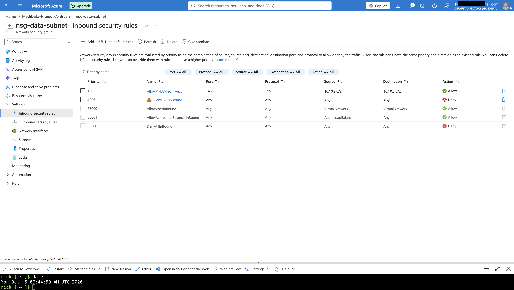

*Figure 6: Data-Subnet NSG inbound rules.*

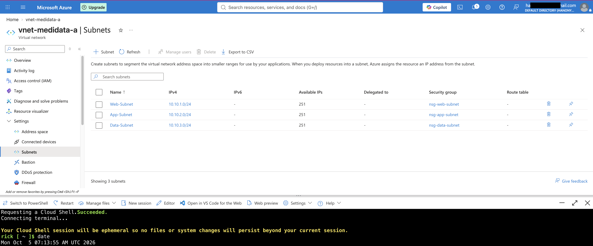

*Figure 7: NSG association with each subnet.*

### 2.4 Data Encryption and Key Management (Part 2.1)

**Storage account** `stmedidatabryan9918`: HTTPS only, minimum TLS 1.2, public blob access disabled, shared-key access disabled, and firewall set to Deny.

**Key Vault** `kv-medidata-bryan-22581`: RBAC authorization, soft delete and purge protection. The key `cmk-medidata-storage` is RSA 3072 and limited to `wrapKey` and `unwrapKey`.

| | Before | After |
|---|---|---|
| `encryption.keySource` | `Microsoft.Storage` (platform-managed key) | `Microsoft.Keyvault` (customer-managed key) |
| Key | Microsoft-managed | `cmk-medidata-storage` in MediData's vault |

The storage account uses **envelope encryption**. Data is encrypted with a data encryption key, which is itself wrapped by the CMK. The storage account's managed identity holds *Key Vault Crypto Service Encryption User* on that single key only, so it can wrap and unwrap but cannot read, export or delete the key. The key is referenced without a version, so the storage account automatically follows new versions after rotation.

**Rotation policy:** rotate every 90 days (`P90D`), notify 30 days before expiry, and each version expires after 2 years.

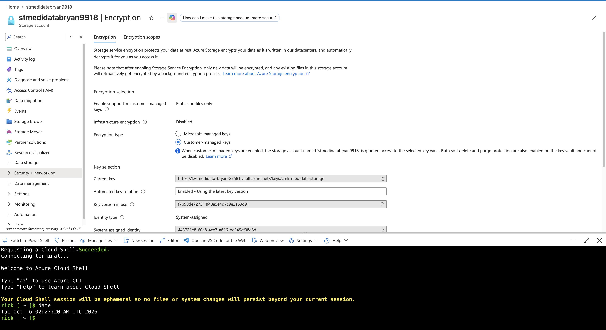

*Figure 8: Storage encryption using the customer-managed key.*

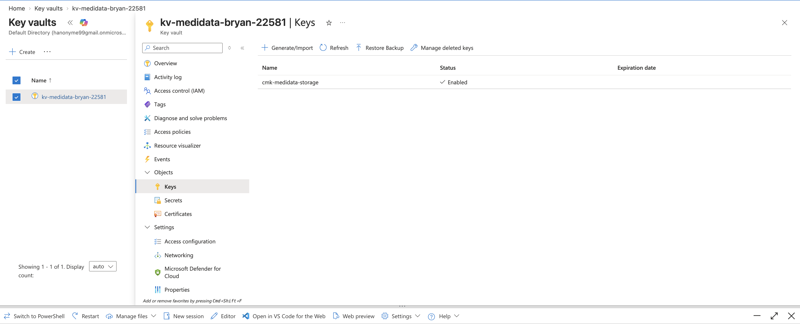

*Figure 9: 90-day key rotation policy.*

**Storage access tests**

| # | Test | Identity | Result |
|---|---|---|---|
| T1 | Custom roles have no data-plane permissions | Definition check | Pass (`DataActions` = 0 for all roles) |
| T2 | Retrieve storage keys | DataEngineer | Pass: keys returned but unusable, because shared-key access is disabled |
| T3 | Change storage network settings | DataEngineer | Gap confirmed: the change was allowed |
| T4 | Change storage network settings | Auditor | Pass: `AuthorizationFailed` |

### 2.5 Security Monitoring (Part 2.2)

- **Defender for Cloud:** Foundational CSPM (free) is enabled on the subscription. It provides Secure Score, recommendations and the regulatory dashboard. All paid plans were left off because of cost.
- **Log Analytics:** the workspace `law-medidata-bryan` (30-day retention) receives every available log and metric category from:
  - the VNet and the three NSGs
  - the storage account and its blob service
  - the Key Vault
  - the subscription Activity log
- **Alert:** `alert-kv-excessive-auth-failures` fires when there are more than 5 failed (401/403) Key Vault requests in 15 minutes (severity 1). It notifies the action group `ag-medidata-security` by email.

This event was chosen because the environment has no VMs or databases, so VM sign-in or SQL alerts would never fire. Repeated authorization failures against the vault holding the patient-data key point to credential misuse or reconnaissance.

**Test:** eight `az keyvault key list` calls made as the Auditor user, who has no Key Vault data role. The alert **fired** at 07:26 UTC on 6 October 2026. The email was not received, probably because of the recipient's mail filter. The fired alert in Azure Monitor is the evidence that the event was detected.

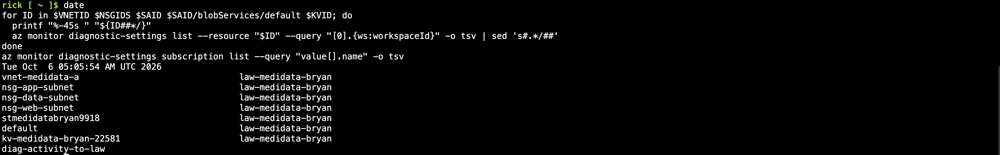

*Figure 10: Diagnostic settings for all resources, verified by CLI.*

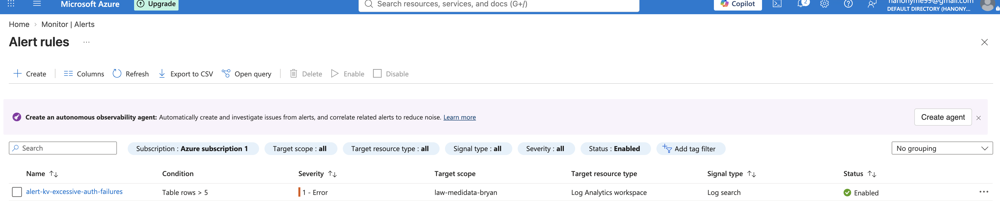

*Figure 11: Alert rule configuration.*

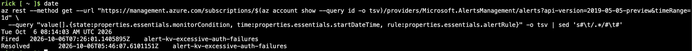

*Figure 12: The alert fired after the simulated attack.*

---

## 3. Justification of Security Controls

| Control | Threat addressed | Principle | HIPAA reference |
|---|---|---|---|
| Custom RBAC roles, Resource Group scope, no `DataActions` | Over-privileged or compromised accounts; insider misuse | Least privilege, separation of duties | 164.308(a)(4) information access management; 164.312(a)(1) access control |
| Shared-key access disabled | Keys bypass Entra ID and RBAC | Identity-based access only | 164.312(a)(1), 164.312(d) authentication |
| Three-tier VNet, NSG per subnet, explicit deny | Direct internet access to data; lateral movement after a breach | Zero Trust, defence in depth | 164.312(a)(1), 164.312(e)(1) transmission security |
| Storage and Key Vault firewalls with service endpoints | Use of stolen credentials from any network | Zero Trust (verify network as well as identity) | 164.312(a)(1), 164.312(e)(1) |
| Customer-managed key in Key Vault | Loss of control over key lifecycle; inability to revoke access | Customer key ownership, crypto-shredding | 164.312(a)(2)(iv) encryption and decryption |
| 90-day key rotation | Long-term key compromise | Limit exposure window | 164.312(a)(2)(iv) |
| Purge protection and soft delete | Malicious or accidental key deletion (data permanently unreadable) | Availability, resilience | 164.308(a)(7) contingency plan |
| HTTPS only, TLS 1.2 | Interception in transit | Encryption in transit | 164.312(e)(2)(ii) |
| Central logging in Log Analytics | Scattered logs; undetected incidents | Visibility, auditability | 164.312(b) audit controls |
| Key Vault authorization-failure alert | Credential misuse against the key protecting PHI | Detect and respond | 164.308(a)(1)(ii)(D) information system activity review; 164.308(a)(6) incident procedures |
| Azure Policy HITRUST/HIPAA (audit) | Unmeasured compliance drift | Continuous compliance | 164.308(a)(1)(ii)(A) risk analysis; 164.308(a)(8) evaluation |

**Why CMK rather than the platform-managed key.** Both use AES-256. CMK gives MediData control over the key lifecycle: it can rotate, disable or revoke the key, and every key operation is logged. Revoking the key makes the data unreadable even to the cloud provider, which helps meet breach-response and data-sovereignty expectations for PHI.

**Why service endpoints rather than private endpoints.** Service endpoints are free and remove the internet path for Data-Subnet traffic. Private endpoints are stronger, because they give the resource a private IP and allow public access to be disabled entirely, but they cost money. They are proposed for production.

---

## 4. Compliance Analysis

### 4.1 Assessment Tool

The built-in Azure Policy initiative **HITRUST/HIPAA** was assigned to the Resource Group as `MediData - HITRUST/HIPAA (audit)` with enforcement `DoNotEnforce`. It reports compliance without blocking or changing anything. Its system-assigned identity has no roles.

Alternatives were rejected:

- **Microsoft Purview Compliance Manager:** focused on Microsoft 365; its HIPAA template needs premium licensing.
- **Defender for Cloud regulatory standards:** adding HIPAA requires the paid Defender CSPM plan.

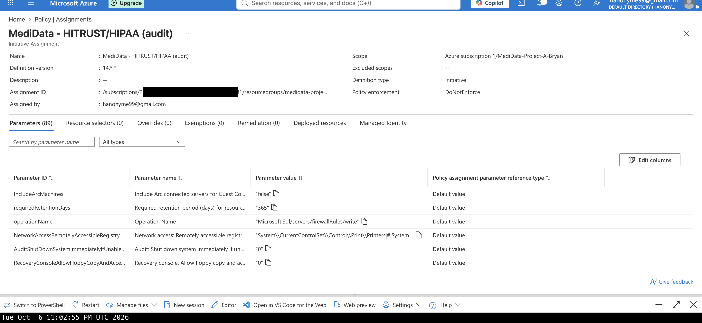

*Figure 13: HITRUST/HIPAA initiative assigned in audit mode.*

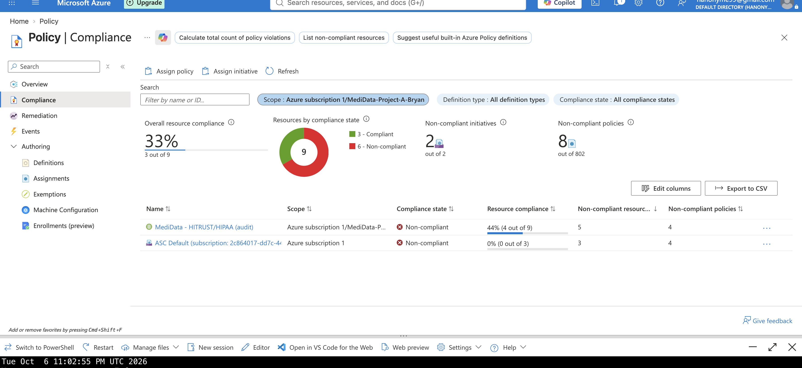

*Figure 14: Compliance dashboard before remediation.*

### 4.2 Results and Validation

The first scan reported 6 non-compliant resources across two assignments: the HIPAA initiative, and the Microsoft cloud security benchmark that Defender for Cloud assigns automatically. Filtering on the HIPAA assignment gave four findings.

| Policy | Resource | HITRUST control |
|---|---|---|
| Key Vault should use a VNet service endpoint | kv-medidata-bryan-22581 | 01.m, 09.m |
| Storage accounts should use a VNet service endpoint | stmedidatabryan9918 | 01.m, 09.m |
| Audit diagnostic setting | kv-medidata-bryan-22581 | 09.aa |
| NSGs on subnets | Web-, App-, Data-Subnet | 01.m, 01.n |

The NSG finding was a **false positive**. The CLI showed all three subnets associated with their NSGs (Figure 7). The policy relies on a Defender for Cloud assessment that lags behind configuration changes.

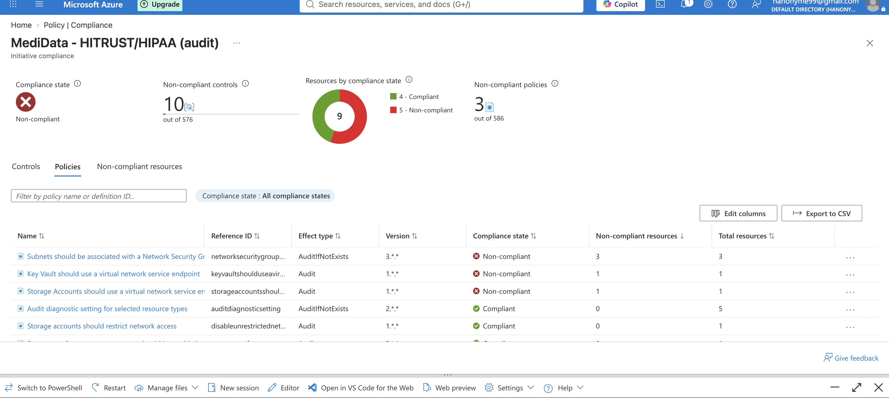

*Figure 15: Non-compliant policies in the HIPAA assignment.*

### 4.3 Two Key Gaps

**Gap 1: Data stores holding PHI reachable from public networks.** The Key Vault holding the CMK and the storage account holding patient data had no VNet service endpoint or private endpoint, and the Key Vault firewall allowed all networks. Anyone with stolen credentials could reach the key and the data from any internet address.

- HIPAA: 164.312(a)(1) access control; 164.312(e)(1) transmission security
- HITRUST: 01.m segregation in networks; 09.m network controls

**Gap 2: Key Vault audit logging not configured as required.** The diagnostic setting used the `allLogs` category group, with `audit` disabled, instead of the named `AuditEvent` category the control checks for. The logs did flow, but compliance with the audit-logging control could not be shown.

- HIPAA: 164.312(b) audit controls
- HITRUST: 09.aa audit logging

### 4.4 Remediation

| # | Action | Gap | Status |
|---|---|---|---|
| 1 | Key Vault diagnostic setting rewritten with named categories `AuditEvent` and `AzurePolicyEvaluationDetails` | 2 | Implemented |
| 2 | `Microsoft.KeyVault` and `Microsoft.Storage` service endpoints added to Data-Subnet | 1 | Implemented |
| 3 | Storage firewall: default Deny, trusted Azure services allowed, VNet rule for Data-Subnet | 1 | Implemented |
| 4 | Key Vault firewall: default Deny, trusted Azure services allowed (keeps CMK working), VNet rule for Data-Subnet | 1 | Implemented |
| 5 | Private endpoints and Private DNS; disable public network access | 1 | Proposed (about USD 7-8 per month each) |
| 6 | Azure Policy with Deny effect for storage and Key Vault without network restrictions; DeployIfNotExists for diagnostic settings | 1, 2 | Proposed (also closes DataEngineer gap T3) |
| 7 | Archive logs to immutable storage for 6 years (164.316(b)(2)) | 2 | Proposed |
| 8 | Data classification of PHI with Microsoft Purview | Additional | Proposed |
| 9 | Azure DDoS Network Protection | Additional | Proposed (about USD 2,900 per month) |

**Verification:**

- Both resources show `defaultAction: Deny`, `bypass: AzureServices` and one VNet rule.
- A Key Vault request from Cloud Shell (outside the VNet) returned `ForbiddenByFirewall`.
- Storage encryption still showed `Microsoft.Keyvault`, key `cmk-medidata-storage`, status `available`.
- The rescan at 07:10 UTC on 7 October 2026 left only the NSG false positive. Both gaps were closed.

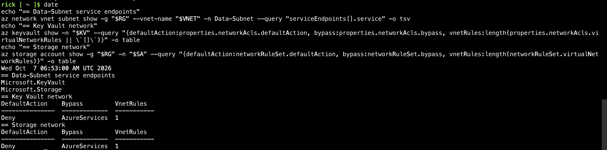

*Figure 16: Service endpoints and firewall settings after remediation.*

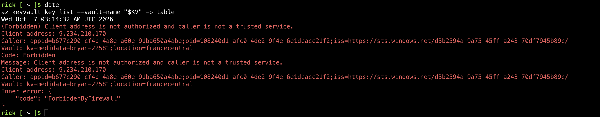

*Figure 17: Key Vault firewall blocking access from outside the VNet.*

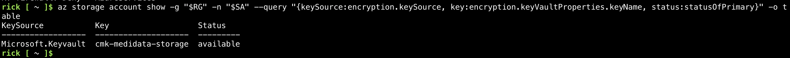

*Figure 18: CMK encryption still active after the firewall change.*

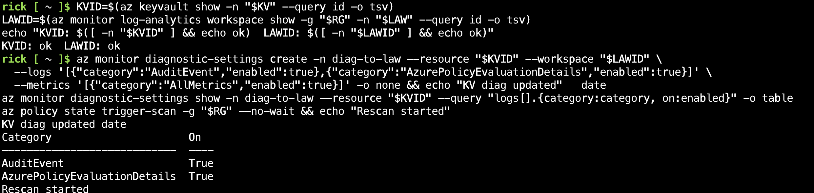

*Figure 19: Key Vault diagnostic setting with named categories.*

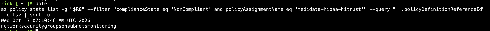

*Figure 20: Only the NSG false positive remains after remediation.*

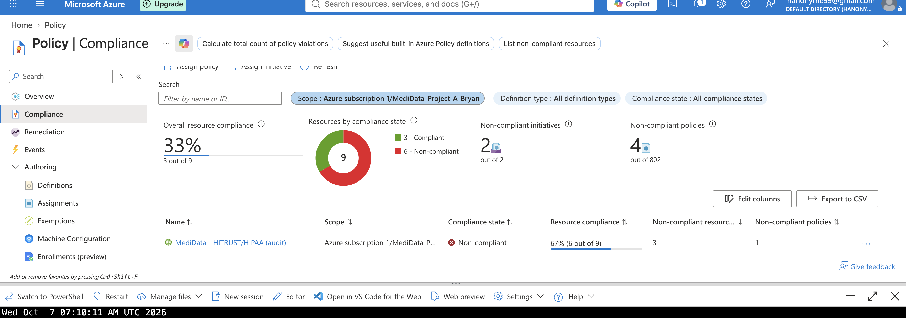

*Figure 21: Compliance dashboard after remediation.*

---

## 5. Lessons Learned

### 5.1 Challenges

| Challenge | Resolution | Lesson |
|---|---|---|
| `az policy assignment create` failed with `PolicySetDefinitionNotFound`, then the CLI crashed | Passed the initiative name instead of its full ID | Tooling has bugs; keep a REST API or Portal fallback |
| Compliance tool flagged NSGs that were attached | Checked the real configuration with the CLI | Compliance tools produce false positives; validate every finding |
| Two variables saved on one line in `env.sh`; Key Vault commands failed while storage commands succeeded | Rewrote the file; checked variables with `echo` | Verify inputs at the start of each session |
| A command printed an error but the success message still appeared | Checked the resulting state (`vnetRules: 1`) | Verify outcomes, not messages |
| The alert email did not arrive | Used the fired alert in Azure Monitor as evidence | Use more than one notification channel |
| The Key Vault firewall blocked administration from Cloud Shell | Temporary `/32` IP rule when needed | Security controls have operational costs; plan admin access in advance |
| No VMs because of cost | Validated NSGs from configuration | Document what was and was not tested live |
| The "before" screenshot was lost because the fix was applied first | Used the recorded output and the dashboard | Capture the before-state before changing anything |

### 5.2 What I Would Do Differently

- Write the whole environment as Infrastructure as Code (Bicep or Terraform) from the start, so it can be rebuilt and reviewed.
- Assign Azure Policy with **Deny** effects at the beginning, so misconfigurations are prevented rather than found later.
- Use private endpoints and disable public network access on data services from the start.
- Deploy a small test VM per tier to validate NSG rules with live traffic and Network Watcher.
- Add Microsoft Sentinel for correlation and automated response, and keep logs longer.

### 5.3 Conclusion

The environment now combines least-privilege identities, a segmented network, customer-controlled encryption, central monitoring with a tested alert, and continuous compliance assessment. The two most important HIPAA gaps found by the assessment were closed and verified. The remaining items need paid services and are documented as a costed remediation plan.

---

## 6. References

1. Microsoft Learn. *Azure custom roles.* https://learn.microsoft.com/azure/role-based-access-control/custom-roles
2. Microsoft Learn. *Network security groups.* https://learn.microsoft.com/azure/virtual-network/network-security-groups-overview
3. Microsoft Learn. *Virtual network service endpoints.* https://learn.microsoft.com/azure/virtual-network/virtual-network-service-endpoints-overview
4. Microsoft Learn. *Customer-managed keys for Azure Storage encryption.* https://learn.microsoft.com/azure/storage/common/customer-managed-keys-overview
5. Microsoft Learn. *Configure key auto-rotation in Azure Key Vault.* https://learn.microsoft.com/azure/key-vault/keys/how-to-configure-key-rotation
6. Microsoft Learn. *Configure Azure Key Vault networking settings.* https://learn.microsoft.com/azure/key-vault/general/how-to-azure-key-vault-network-security
7. Microsoft Learn. *Configure Azure Storage firewalls and virtual networks.* https://learn.microsoft.com/azure/storage/common/storage-network-security
8. Microsoft Learn. *Microsoft Defender for Cloud overview.* https://learn.microsoft.com/azure/defender-for-cloud/defender-for-cloud-introduction
9. Microsoft Learn. *Diagnostic settings in Azure Monitor.* https://learn.microsoft.com/azure/azure-monitor/essentials/diagnostic-settings
10. Microsoft Learn. *Log search alerts in Azure Monitor.* https://learn.microsoft.com/azure/azure-monitor/alerts/alerts-types
11. Microsoft Learn. *Regulatory compliance details for HIPAA HITRUST.* https://learn.microsoft.com/azure/governance/policy/samples/hipaa-hitrust
12. U.S. Department of Health and Human Services. *The HIPAA Security Rule, 45 CFR Part 164, Subpart C.* https://www.hhs.gov/hipaa/for-professionals/security/index.html
13. ISN 4153 Cloud Computing Security, course materials, Summer 2026.

---

## Appendix A: Environment Summary

| Item | Value |
|---|---|
| Region | France Central |
| Resource Group | MediData-Project-A-Bryan |
| Custom roles | 3 |
| Subnets / NSGs | 3 / 3 |
| Encryption | CMK (RSA 3072), 90-day rotation |
| Log Analytics retention | 30 days |
| Paid services used | None (Key Vault Standard operations only) |
| Cleanup | Delete the Resource Group after grading; the vault stays soft-deleted for 7 days |

Scripts and detailed documentation are in the repository folders `security/`, `compliance/` and `infrastructure/`. The troubleshooting log is in `docs/`.

## Appendix B: Figure Index

| Figure | Description | File |
|---|---|---|
| 1 | Custom roles | 02-rbac/all-custom-roles-portal.png |
| 2 | Role assignments | 02-rbac/role-assignments-portal.png |
| 3 | Auditor test | 02-rbac/test-auditor-cli.png |
| 4 | SecurityAdmin test | 02-rbac/test-secadmin-denied-and-allowed-cli.png |
| 5 | DataEngineer test | 02-rbac/test-dataeng-allowed-and-denied-cli.png |
| 6 | Data-Subnet NSG rules | 04-nsg/data-subnet-nsg-inbound-rules-portal.png |
| 7 | NSG associations | 04-nsg/nsg-subnet-associations-portal.png |
| 8 | CMK encryption | 05-storage/storage-encryption-cmk-portal.png |
| 9 | Rotation policy | 06-keyvault/key-rotation-policy-portal.png |
| 10 | Diagnostic settings | 08-monitoring/diag-all-resources-cli.png |
| 11 | Alert rule | 08-monitoring/alert-rule-portal.png |
| 12 | Alert fired | 08-monitoring/alert-fired-cli.png |
| 13 | HIPAA assignment | 09-compliance/policy-assignment-hipaa-portal.png |
| 14 | Dashboard before | 09-compliance/compliance-dashboard-portal.png |
| 15 | HIPAA findings | 09-compliance/compliance-hipaa-details-portal.png |
| 16 | Network after | 09-compliance/g3b-network-after-cli.png |
| 17 | Firewall blocked | 09-compliance/g3b-kv-firewall-blocked-cli.png |
| 18 | CMK still active | 09-compliance/g3b-cmk-still-active-cli.png |
| 19 | KV diagnostics after | 09-compliance/kv-diag-after-cli.png |
| 20 | Compliance after (CLI) | 09-compliance/compliance-after-g3-cli.png |
| 21 | Dashboard after | 09-compliance/compliance-dashboard-after-portal.png |
