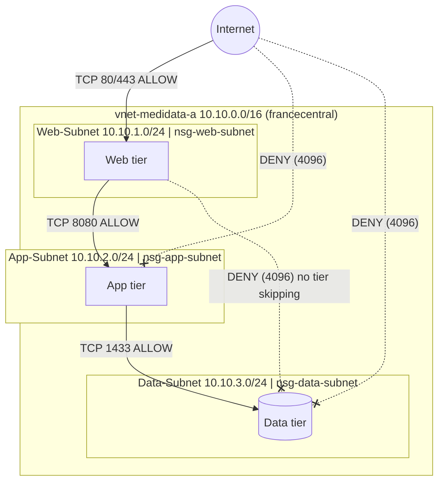

# Network Segmentation (Exam Part 1.2)

Status: **IMPLEMENTED** (VNet, 3 subnets, 3 NSGs, associations verified by CLI on 2026-10-05). Traffic validation: **configuration-based** (no VMs deployed, to avoid cost).

## Architecture

## IP Plan

| Network | Range |
|---|---|
| vnet-medidata-a | 10.10.0.0/16 |
| Web-Subnet | 10.10.1.0/24 |
| App-Subnet | 10.10.2.0/24 |
| Data-Subnet | 10.10.3.0/24 |

## NSG Inbound Rules

| NSG | Priority | Name | Source | Destination | Port (TCP) | Action |
|---|---|---|---|---|---|---|
| nsg-web-subnet | 100 | Allow-HTTP-HTTPS-Internet | Internet | 10.10.1.0/24 | 80, 443 | Allow |
| nsg-web-subnet | 4096 | Deny-All-Inbound | * | * | * (any protocol) | Deny |
| nsg-app-subnet | 100 | Allow-8080-From-Web | 10.10.1.0/24 | 10.10.2.0/24 | 8080 | Allow |
| nsg-app-subnet | 4096 | Deny-All-Inbound | * | * | * (any protocol) | Deny |
| nsg-data-subnet | 100 | Allow-1433-From-App | 10.10.2.0/24 | 10.10.3.0/24 | 1433 | Allow |
| nsg-data-subnet | 4096 | Deny-All-Inbound | * | * | * (any protocol) | Deny |

Azure default rules (65000 AllowVnetInBound, 65001 AllowAzureLoadBalancerInBound, 65500 DenyAllInBound) remain but are never reached for inbound traffic, because rule 4096 matches everything first.

## Rule Walk-Through (Configuration-Based Validation)

| Flow | Matching rule | Result |
|---|---|---|
| Internet -> Web TCP 443 | web 100 | ALLOW |
| Internet -> Web TCP 22 (SSH) | web 4096 | DENY |
| Web -> App TCP 8080 | app 100 | ALLOW |
| Internet -> App TCP 8080 | app 4096 (source not 10.10.1.0/24) | DENY |
| App -> Data TCP 1433 | data 100 | ALLOW |
| Web -> Data TCP 1433 (tier skipping) | data 4096 (source not 10.10.2.0/24) | DENY |
| Internet -> Data TCP 1433 | data 4096 | DENY |
| Without rule 4096: Web -> Data any port | default 65000 AllowVnetInBound | would be ALLOW |

NSGs are stateful: replies to allowed connections return automatically, so no matching outbound rules are needed.

## Design Notes and Limitations

- Rule 4096 also blocks traffic **between hosts in the same subnet** and Azure Load Balancer health probes. If a load balancer is added later, an explicit `AzureLoadBalancer` allow rule is needed (PROPOSED).
- Only inbound traffic is restricted, as the exam requires. Outbound is still open by Azure default (for example Data-Subnet -> Internet). Restricting outbound is a future improvement (PROPOSED).
- No VMs were deployed, so results are validated from the configuration, not from live traffic. A live test with Network Watcher IP flow verify would require VMs (cost).

Evidence: `docs/screenshots/03-vnet/`, `docs/screenshots/04-nsg/`
